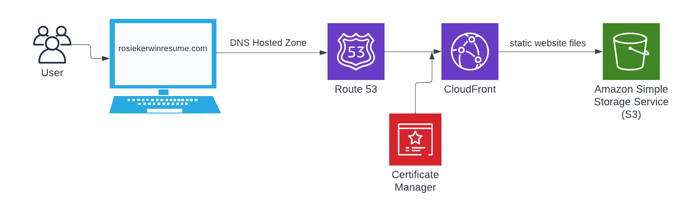
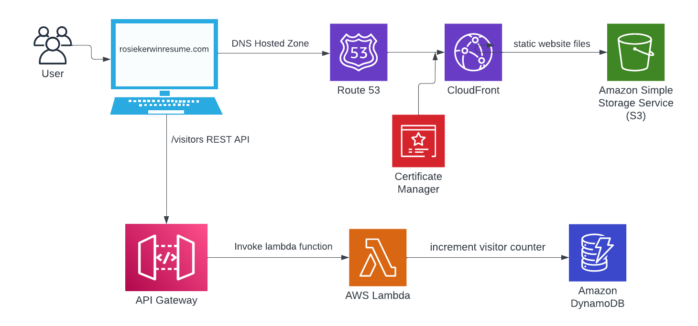

# Cloud Resume Challenge

www.rosiekerwinresume.com

The [AWS Cloud Resume Challenge](https://cloudresumechallenge.dev/docs/the-challenge/aws/) is a crash-course in AWS cloud infrastructure. Although it's designed to help beginners land a job as a Cloud Engineer,  I used it as a project to get my hands dirty with AWS and begin to understand its offerings.

The goal is simple: deploy a static website of your resume using AWS. But the challenge lays out a set of requirements for how this should be accomplished, each of which using a different part of the AWS ecosystem.

### Stage 1 - Creating the website content

The first stage of the challenge was the most straightforward: create a static HTML page for a resume and add some CSS formatting to make it look good. Once that was finished, the files had to be stored somewhere, so I uploaded them to [S3](https://aws.amazon.com/s3/) ("Simple Storage Service"), Amazon's main object storage service. AWS makes it easy to [host a static website using S3](https://docs.aws.amazon.com/AmazonS3/latest/userguide/WebsiteHosting.html), so after a few permissions tweaks, I had a website up and running! 

### Stage 2 - Setting up the domain

The whole goal of the challenge is to set up a website, so of course I needed a domain. The simple way: register a new domain using [Route 53](https://aws.amazon.com/route53/), and set up HTTPS for security with [CloudFront](https://aws.amazon.com/cloudfront/). I made the mistake of registering `rosiekerwin.com` with a domain service that doesn't provide access to SSL certificates (Squarespace, since it was automatically migrated over from the now-defunct Google Domains). Without the SSL certificate, CloudFront wouldn't let me set up HTTPS. I got around this by registering a new domain, `www.rosiekerwinresume.com`, and setting up an automatic redirect from `rosiekerwin.com` to the new site, but it was a lesson learned to make sure I know all the parameters of a project before picking my tech specs!

#### Architecture So Far
We have a domain registered with Route 53 and a CloudFront CDN for security and caching. We also are using [Certificate Manager](https://aws.amazon.com/certificate-manager/) to manage SSL/TLS certificates for the CloudFront distribution. Cloudfront fetches the static website files from our S3 bucket.

***Personal Learning Moment: What is a CDN?***
A CDN, or "content delivery network", is a network of servers that are globally distributed in order to deliver static content efficiently to end users. When a user visits a site, the CDN routes the request to the nearest "edge location" — the closest server in its network will provide a copy of the static content to improve latency and performance.

### Stage 3 - Backend infrastructure

In order to make this project a little more interesting, one of the requirements is to include a counter of visits to the site. Each time the page is loaded, there should be a message at the bottom of the page that tells the user which number visitor they are. This is done with a [DynamoDB](https://aws.amazon.com/dynamodb/) database and a [Lambda](https://aws.amazon.com/lambda/) function.

DynamoDB and Lambda are both "serverless" and quite simple to set up. DynamoDB is a NoSQL databse, so I created a table called `resume-visitors` with a single key-value pair: key `views` is mapped to a value of type `number` for view count for the site. I then created a Lambda function in Python, `incrementVisitorCounter`, that reads the current view count from the database, increments the counter by one, writes it back to the database, and returns the new view count in a `JSON` response.

One thing I noticed during this section is that every time I tested by Lambda function, it incremented the value in the production database. This underscores the importance of having dev versions of everything in order to maintain accurate production data.

***Personal Learning Moment: What is serverless architecture?***
Both Lambda and DynamoDB are "serverless" offerings. This means that I as a developer don't have to manage the servers or infrastructure where they run; it happens dynamically and scales up as needed. The name "serverless" is a bit of a misnomer, because there *are* servers, but the setup and maintenance isn't the user's problem :)

### Stage 4 - Connecting the UI to the backend

I created an API to accept requests from the UI and call the Lambda function. This was pretty straightforward with [API Gateway](https://aws.amazon.com/api-gateway/); I created a REST API to update the visitor counter and return the value on a `POST` request to the `/visitors` endpoint.

Next, I had to update the website to actually call the endpoint! This was done with a little javascript — I embedded a small script within my `index.html` file to send a `POST` request and update the web page to show the number. Since the API call happens on page load, it was important to make sure the UX is seamless and the page doesn't jump when the visitors value is filled in from the API response. I'm sure there are more elegant solutions, but I just added a placeholder `...` where the visitor count number would go, and that did the trick.

The hardest part about this section was setting up CORS. CORS, or "Cross-origin resource sharing", ensures that requests between browsers and servers are secure. In 
order to allow my UI to contact the Lambda function, I had to add some `Access-Control-Allow-*` headers to the Lambda JSON response.

#### Architecture So Far
We've add a DynamoDB table to store our visitor counter, a Lambda function to fetch and update the counter, and an API gateway to connect the frontend and backend code through a simple REST API.

### Stage 5 - CI/CD and Testing

I created a some end-to-end tests using [Cypress](https://www.cypress.io/) to load the actual UI and verify that it works as expected. I made some assertions on the correctness of the resume information as well as the response of a POST request.

Finally, it was time to upload all of this work to GitHub! I created a repository and set up [GitHub Actions](https://github.com/features/actions) to run the cypress tests and deploy the new code/files to AWS on each commit.

#### Final architecture

We're done! The last chunk of the architecture includes me, the developer. When I do a `git push` to upload file changes from my machine to the repository, the GitHub actions are run (including the cypress tests), and the new files are uploaded to S3.

